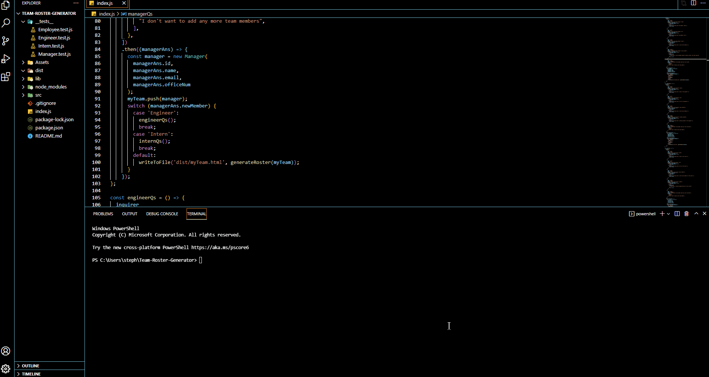

# Team Roster Generator

## Description

A CLI to build a HTML page of colour-coded cards with information and clickable contact details for team members; Manager, Engineer & Intern.
This project also contains tests for each constructor class.

## LANGUAGE : JavaScript, HTML

## TOOLS : Node.js, Bootstrap, Jest

## FILES

- **tests** > 4 files with tests for each constructor class
- Assets > project-demo.gif - demonstration video & EXAMPLE-ROSTER.html - example of a HTML page generated using this CLI
- lib > separate constructor class files for each team role
- Team-Roster - folder where generates HTML will be saved
- utils > generateHTML.js - functions to dynamically generate HTML page from user input
- .gitignore > file to record local files that should not be uploaded to repository e.g. node_modules
- index.js > modules, packages, team role questions and writeToFile function
- package-lock.json - node modules tree visiblity
- package.json - node.js metadata
- README.md - project information

## Table of Contents

- [Installation](#installation)
- [Usage](#usage)
- [Contributing](#contributing)
- [Tests](#tests)
- [Questions](#questions)

## Installation

Clone the repository from GitHub, open the project in a code editor e.g. VS Code, and run the index.js file in the terminal where you are presented with questions to dynamically generate your team's HTML page.

## Usage

Navigate to the correct folder and run the index.js file in the command line to answer questions about your team.
Below is a demonstration of this being completed following a succesful run of testing.

## Contributing

Read the installation notes. Any contributions or improvements very welcome, but please do not push changes directly to the main branch - please create your own branch and push changes for review.

## Tests

npm run test

## Questions

If you have any questions about this project, please contact me directly at viennabdev@gmail.com. You can view more of my projects at https://github.com/ViennaBorowska.
